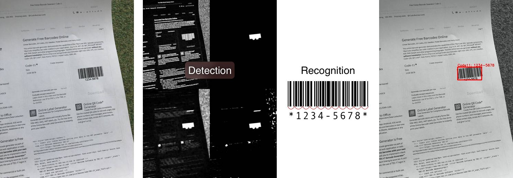

# BarCode11


[](./License)https://opensource.org/licenses/MIT
[](https://twitter.com/intent/tweet?text=Cool%20example%20how%20to%20build%20you%20own%20BarCode%20scanner&url=https://github.com/RoadAR/Tutor_BarCode11)

This code designed to demostrate how you can build your own barcode scanner from scratch with `OpenCV` library.



## Build/Run

```
mkdir build
cd build
cmake ..
make -j6
./main
```

Or if you have `XCode` just open `BarCode11.xcodeproj` and run

## License

The code is licensed under the [MIT License](https://opensource.org/licenses/MIT)
